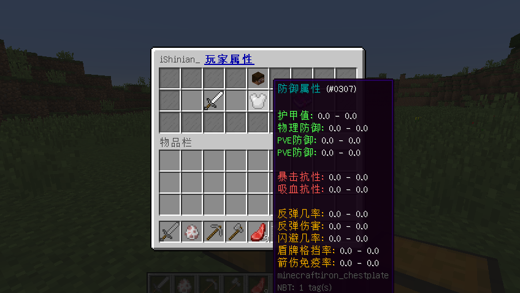

# 插件相关

## 配置列表

| \*                                                                                         | 说明              |
| ------------------------------------------------------------------------------------------ | --------------- |
| [attribute.yml](https://ersha.gitbook.io/attributeplus-pro/cha-jian-pei-zhi/attribute.yml) | 插件属性相关配置        |
| [stats.yml](https://ersha.gitbook.io/attributeplus-pro/cha-jian-pei-zhi/stats.yml)         | 插件 Stats 界面相关配置 |

## 插件命令

建议在游戏内输入 `/ap` 命令，来查看命令详细介绍

| \*                                    | 说明                     |
| ------------------------------------- | ---------------------- |
| ap stats                              | 打开属性统计面板               |
| ap update \[player]                   | 刷新玩家属性                 |
| ap source \[player]                   | 查看玩家属性来源               |
| ap persistent \[player] \[...] ...    | 新增持久化属性源 (可给临时属性,永久属性) |
| ap del-persistent \[player] \[source] | 删除一个持久化属性源             |
| ap reload                             | 重载插件                   |

## 为什么我的属性详细界面不是书本界面?

因为你没有在 [**stats.yml**](https://ersha.gitbook.io/attributeplus-pro/cha-jian-pei-zhi/stats.yml) 配置内将 **options** 设为 **"BOOK"**

```yaml
#BOOK 则通过书本方式展示属性内容 (1.9+)
#GUI 则通过箱子界面展示属性内容 (1.7+)
options: "BOOK"
```

{H0.png)

<div align="center"></div>
