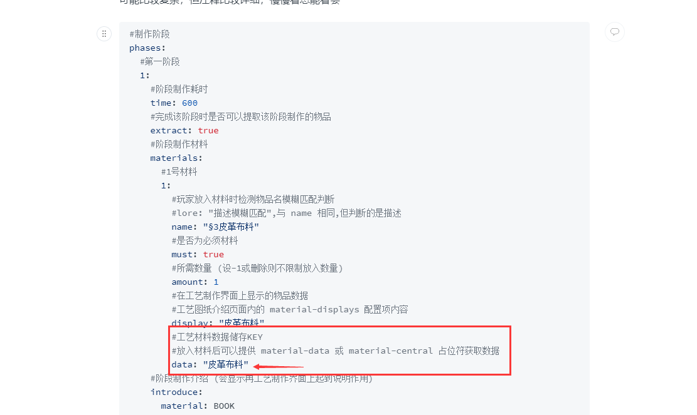

# Material-Data


下方占位符中的 KEY 你不知道是什么？(看图)


<figure><figcaption></figcaption></figure>

1.0.1 更新 **获取NBT** 方法



> 占位符格式

```yaml
{material-data *key *get-amount}
```


> 占位符用法

获取工艺制作界面内放入的材料数量 ( `key` 为指定 **工艺材料数据储存名** )



> 占位符格式

```yaml
{material-data *key *get-type}
```


> 占位符用法

获取工艺制作界面内放入的材料类型 ( `key` 为指定 **工艺材料数据储存名** )



> 占位符格式

```yaml
{material-data *key *get-name}
```


> 占位符用法

获取工艺制作界面内放入的材料名称 ( `key` 为指定 **工艺材料数据储存名** )



> 占位符格式

```yaml
{material-data *key *get-nbt *NBT名 *默认值}
```

```yaml
{material-data *key *get-nbt *NBT名.NBT名 *默认值}
```


> 占位符用法

获取工艺制作界面内放入的材料指定NBT数据值 ( `key` 为指定 **工艺材料数据储存名** )





> 占位符格式

```yaml
{material-data *key *type *物品类型}
```


> 占位符用法

获取工艺制作界面内放入材料类型是否匹配的上， `key` 为指定 **工艺材料数据储存名**\
返回 **true / false**



> 占位符格式

```yaml
{material-data *key *contains *[文本,文本,...]}
```


> 占位符用法

获取工艺制作界面内放入材料名称、描述是否存在文本内容，该匹配为模糊匹配， `key` 为指定 **工艺材料数据储存名** 返回 **true / false**



> 占位符格式

```yaml
{material-data *key *lore-contains *[文本,文本,...]}
```


> 占位符用法

获取工艺制作界面内放入材料描述是否存在文本内容，该匹配为模糊匹配， `key` 为指定 **工艺材料数据储存名** 返回 **true / false**



> 占位符格式

```yaml
{material-data *key *name-contains *[文本,文本,...]}
```


> 占位符用法

获取工艺制作界面内放入材料名称是否存在文本内容，该匹配为模糊匹配， `key` 为指定 **工艺材料数据储存名** 返回 **true / false**



1.0.1 更新 **特殊格式-部分描述筛选** 方法

1.0.5 更新 **获取部分描述行数** 方法



> 占位符格式

```yaml
{material-data *key *lore-filter *[文本,文本,...]}
```


> 占位符用法

获取工艺制作界面内放入的材料内包含指定文本的描述，该匹配为模糊匹配， `key` 为指定 **工艺材料数据储存名** 返回 **符合的描述** 格式为 `"描述,描述,..."`



> 占位符格式

```yaml
{material-data *key *plugin-lore-filter *[文本,文本,...]}
```


> 占位符用法

获取工艺制作界面内放入的材料内包含指定文本的描述，该匹配为模糊匹配， `key` 为指定 **工艺材料数据储存名** 返回 **符合的描述** 格式为 `"$=[描述,描述,...]"`<br>


该占位符所返回的数据可使用 describe action 内的 add-line 方法，将筛选的描述复制到工艺制作物上




> 占位符格式

```yaml
{material-data *key *plugin-part-lores *起始行 *结束行}
```


> 占位符用法

获取工艺制作界面内放入的材料描述中，从 `起始行` 至 `结束行` 内的描述，返回格式为 `"$=[内容]"`  可使用 `describe action` 动作脚本，将读取出来的描述添加至工艺物上，典型的使用例子是 [继承示例](../gong-yi-shi-li-pei-zhi/ji-cheng-shi-li.md) 配置， `key` 为指定 **工艺材料数据储存名**

返回 **符合的描述** 格式为 `"$=[描述,描述,...]"`

```yaml
例如 物品描述 如下
- "AAA"
- "起始A"
- "BBB"
- "结束B"

那么 {material-data *key *plugin-part-lores *起始A *结束B} 可读取到
- "起始A"
- "BBB"
- "结束B"
```



#### 1.0.5 新增方法-**获取部分描述行数**

> 占位符格式

```yaml
{material-data *key *get-part-line-size *起始行 *结束行}
```


> 占位符用法

获取工艺制作界面内放入的材料描述中，从 `起始行` 至 `结束行` 内的描述行数

返回 **行数**





> 占位符格式

```yaml
{material-data *key *lore-value *读取格式}
```


> 占位符用法

获取工艺制作界面内放入的材料内符合读取格式的数据值，该匹配为模糊匹配， `key` 为指定 **工艺材料数据储存名** 返回 **数值 (浮点类型)**<br>


格式例子 **"+(.\*?)% 锻造强度"** 即可读取指定材料数据储存数据描述上的  **(.\*?)** 上的数据值，也可以是 **"锻造强度 +(.\*?)"** 的格式，可完全自定义，读取出来的数值会乘以放入的材料数量




> 占位符格式

```yaml
{material-data *key *lore-text *读取格式}
```


> 占位符用法

获取工艺制作界面内放入的材料内符合读取格式的数据值，该匹配为模糊匹配， `key` 为指定 **工艺材料数据储存名** 返回 **文本**<br>


格式例子 **"+(.\*?)% 锻造强度"** 即可读取指定材料数据储存数据描述上的 **(.\*?)** 位置上的文本，也可以是 **"锻造强度 +(.\*?)"** 的格式，可完全自定义



