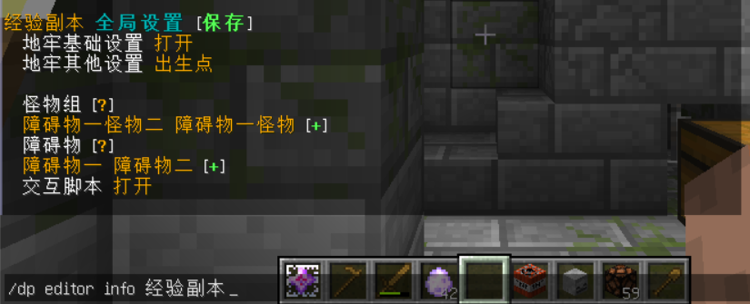
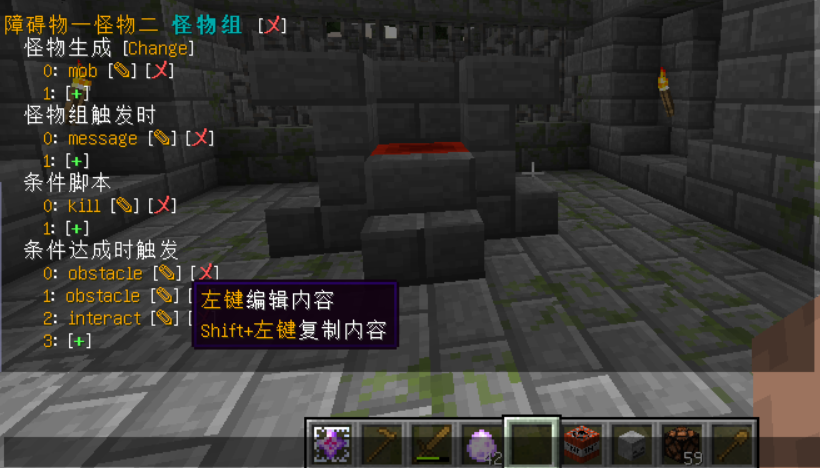
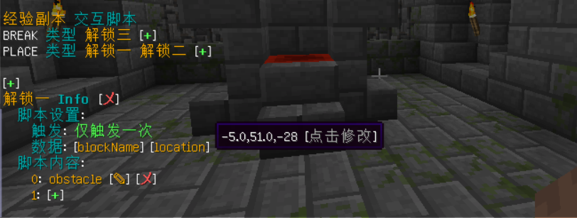

# 地牢编辑

## 在线编辑

在游戏内通过 **/dp editor edit <地牢>** 命令进行地牢在线编辑模式，编辑中的地牢不会影响到玩家们的正常游戏，在编辑模式中你可以更快速的设置你的地牢，输入 **/dp editor info <地牢>** 打开 **快捷编辑面板**

## 可在线编辑的内容

1. 怪物组配置
2. 障碍组配置
3. 交互脚本配置
4. 地牢地图
5. 地牢基础内容

