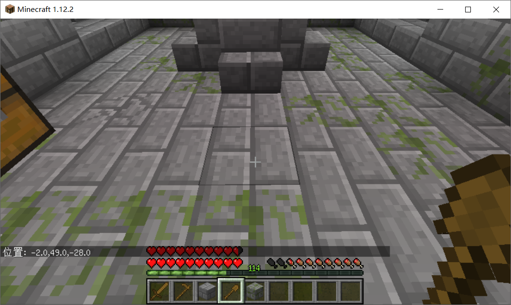
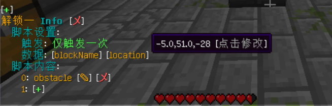

# 快捷选择工具

## 快捷选择工具

地牢脚本设置中有涉及到位置选取等内容，例如 **mob block** 等脚本，用快捷选择工具可以快速的设置改脚本参数等

## 障碍组 快捷设置工具

在障碍组编辑面板 **障碍物数据** 中点击 **\[+]** 按钮,后使用 **锄头** 选择 **A、B** 两个点即可 **自动设置为障碍物区域**

## 怪物组 快捷设置工具

在怪物组编辑面板中点击 **怪物生成** 旁边的 **\[怪物绑定]** 按钮绑定对应怪物数据后点击 **\[+]** 按钮,后使用 **木剑** 点击所需要生成怪物的位置

## 快捷获取位置工具

在编辑地牢中拿着 **木锹** 对着方块点击即可获取对应的位置信息 **(图-1)** 如果点击了脚本编辑后使用 **木锹** 点击后会直接设置为所点击的位置 **(图-2\~3)**

