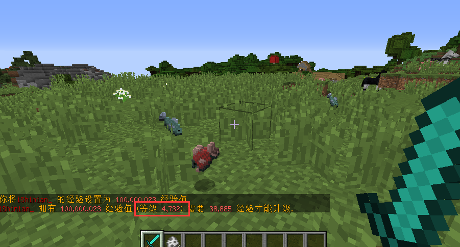

# 属性内嵌条件格式

## 内嵌**读取条件**

自带的属性读取格式有一个额外的 **读取条件** 当 **满足该条件时属性才会被读取**\
你也可以为你服务器开发更多不同的**内嵌条件 (**[**开发文档**](https://ersha.gitbook.io/attributeplus-pro/kai-fa-wen-dang/descriptionlinecondition)**)**\
\
**格式为** "<属性内容> **/** **<条件>**"\
条件必须写在 / 右边,否则不生效 

| 类型       | 说明             |
| -------- | -------------- |
| Lv.<值>   | 使用者等级必须满足才会读取  |
| Gm.<权限名> | 使用者必须拥有该权限才会读取 |

具体用法，你只需要在物品属性Lore上加 **对应类型的读取条件** 即可，例如 **"物理伤害: 1000 / Lv.1000"** 那么装备使用者等级必须大于等于 1000 该属性条目才会生效

