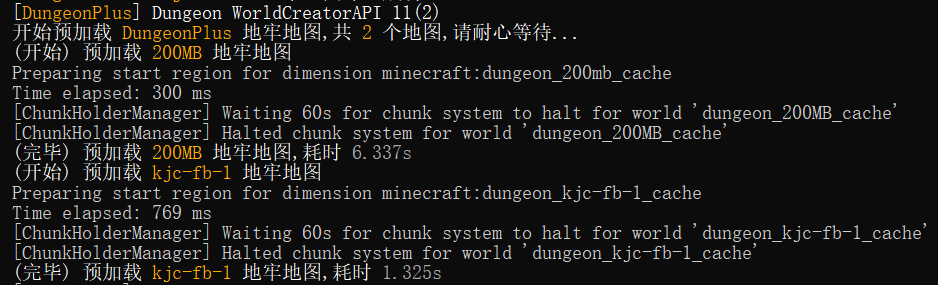
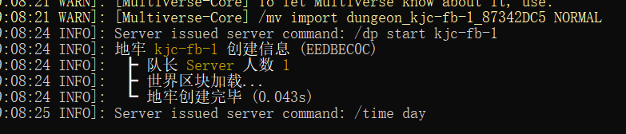
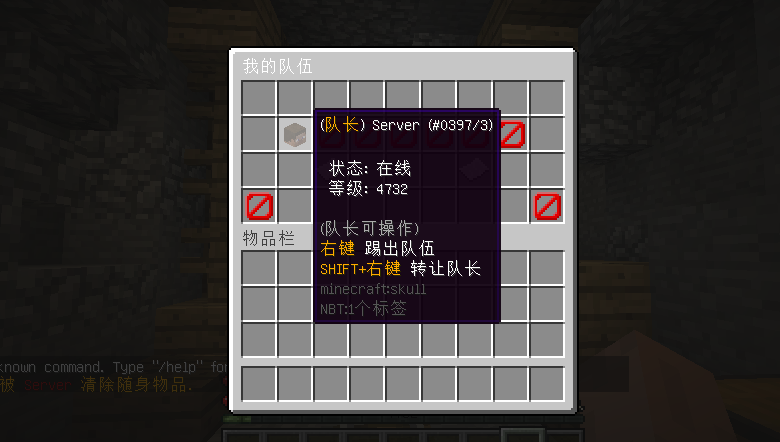
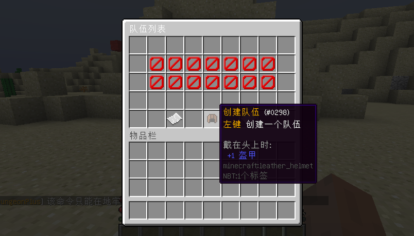

# 1.3.1

## 更新内容

* 升级 **Taboolib Version -> 6.0.10-67** 
* 优化 地牢地图文件 **IO** 操作异步处理
* 优化 地牢世界内容设置优化处理
* 优化 地牢世界创建优化处理
  * 我们通过对 **1.12 \~ 1.19.3** 服务器版本世界创建代码进行了修改完成了此次优化
  * 对于 **1.11** 及以下版本因用户数量少的因素并没有进行优化，将保持原有创建逻辑
  * **1.12 \~ 1.13** (异步创建处理)**:**&#x20;
  * 该版本起将采用异步处理地牢世界插件，感谢 **@枫溪** 提供的帮助
  * 可做到 **0.0N** 秒完成一个 20MB 大小的地牢地图世界创建
  * 已对 **CatServer** 核心进行单独兼容
  * **1.14+** (预加载处理)**:**
  * 因为高版本服务器底层原因，无法实现异步创建操作，所以采用了预加载
  * 的处理方式，将在服务器启动时预加载处理地牢地图，预加载过的地图也
  * 一样可以做到流畅创建地牢，玩家基本感觉不到

<figure><figcaption>
预加载处理 (1.14 +)
</figcaption></figure>

<figure><figcaption>
异步创建 (1.12~1.13)
</figcaption></figure>

* 新增 `DungeonCleanEvent` 地牢清理事件 (该事件会在玩家离开地牢世界后触发)
* 新增 地牢世界创建时触发事件的开关项
  * `dungeon-world-create-init-event` 配置项 WorldInitEvent 事件
  * `dungeon-world-create-load-event` 配置项 WorldLoadEvent 事件
  * 操作此项关闭后将影响到一些插件 (如 **WorldGuard**、**Ess** 等)
  * 例如阻止 **WorldGuard** 插件插件地牢世界配置文件夹 (通过Load事件)
* 新增 地牢结束时自动解散队伍的配置项
  * `dungeon-end-auto-disband` 配置项，默认关闭
* 新增 缓存玩家进入地牢前的位置功能
  * 该功能能完美解决玩家因某种原因 (地牢被卸载、服务器突然关闭) 而造成的卡虚空问题
  * 将移除原先 `login-location-cover` 固定登录点功能 (他完成了他的使命)
* 新增 玩家地牢组队 **GUI界面功能**
  * 布局修改配置为 `team.yml` 配置，界面信息一目了然，让玩家组队不再繁琐
  * 服务器队伍列表界面、玩家队伍信息界面，使用 `/dp team` 命令打开
  * 将移除原先 `BOOK` 书本组队界面功能 (他完成了他的使命)  
* 调整 该版本起玩家开启地牢加入队列等待时禁止输入命令
* 调整 该版本起地牢地图文件夹不再创建至服务端主路径文件夹中
  * 将移动至插件配置文件夹内的 `dungeon-caches` 缓存文件夹中 
* 修复 玩家可通过某种方式将无法带出地牢的物品带出地牢问题
  * 优化了地牢物品带出限制的检测操作

<figure><figcaption>
队伍界面
</figcaption></figure> <figure><figcaption>
队伍列表界面
</figcaption></figure>

