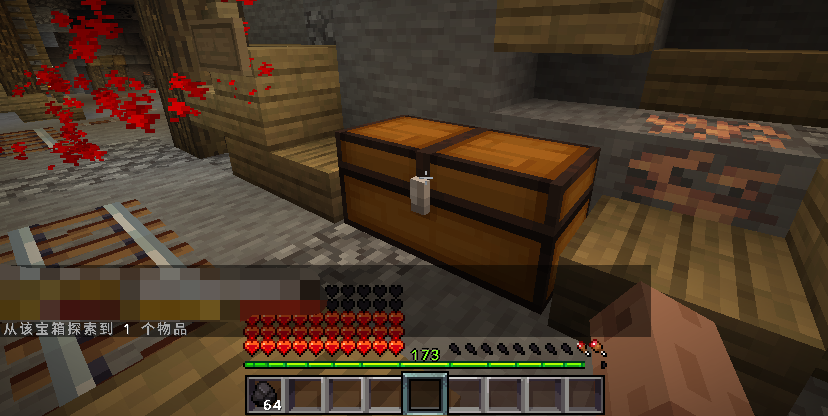

# 1.3.9

## 更新内容

* 新增 地牢世界缓存复用功能
  * 开启该功能将增加一定内存占用，可避免反复加载世界所带来的消耗，启动更快速
  * 请确保服务器没有其他 **世界自动保存** 插件，否则将可能导致地图预缓存功能异常
  * 配置项 `dungeon-pre-folder.instance-keep`
  * 个人测试：开启预加载缓存 30 个世界，比没开启该功能额外消耗 50MB 左右内存消耗
* 新增 地牢宝箱探索功能
  * 该版本起，副本内的箱子将不再为传统的打开箱子界面拾取，改用右键后自动探索
  * 宝箱内的物品需要在编辑地牢中预先放置，每局地牢仅允许探索一次同一位置宝箱

<figure><figcaption></figcaption></figure>

