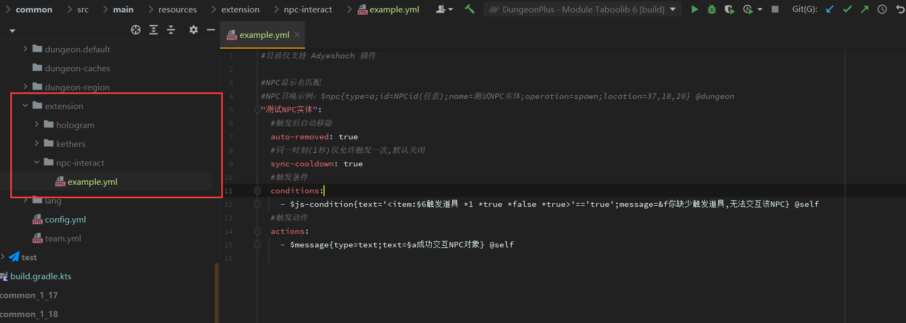

# 1.4.0\~1.4.1

## 更新内容

* 新增 Teleport 脚本 **defspawn** 参数 **(default: true)**
  * 全队传送时将传送点设置为副本默认重生点
*   新增 Setting 脚本 **rejoin** 参数 **(default: false)**

    * 玩家在副本内重新登陆时固定登陆点为副本重生点

    <mark style="color:red;">**1.4.0.1:**</mark>&#x20;
* 新增 **NPC** 地牢交互功能，该功能仅支持 **Adyeshach** 插件
* 修复 地牢内玩家被怪物乘坐时结束地牢，会导致卡在地牢中 **1\~2** 秒时间后才退出副本\
  \
  <mark style="color:red;">**1.4.0：**</mark>
* 修复 **1.3.9** 版本中某项功能可能因为用户异常使用而导致出现的漏洞问题
* 修复 **Hologram** 脚本在清除全息对象时可能无法正常清除问题

<figure><figcaption>
NPC地牢交互功能
</figcaption></figure>
